目录
---
<!-- TOC -->

- [可视化视图的分类](#可视化视图的分类)
- [折线图](#折线图)
- [散点图](#散点图)
- [直方图](#直方图)
- [条形图](#条形图)
- [箱线图](#箱线图)
- [饼图](#饼图)
- [sns.countplot显示一个数据表中的某一列数据里的成分](#snscountplot显示一个数据表中的某一列数据里的成分)
- [高阶](#高阶)
    - [热力图](#热力图)
    - [蜘蛛图](#蜘蛛图)
    - [lmplot线性回归可视化](#lmplot线性回归可视化)
    - [二元变量关系](#二元变量关系)
    - [成对关系](#成对关系)

<!-- /TOC -->
## 可视化视图的分类
><数据分析45讲>/[第15讲](https://time.geekbang.org/column/article/77664)
- 比较
    - `折线图`比较数据随着时间的变化趋势
- 联系
    - `散点图`查看两个或两个以上变量之间的关系
- 分布
    - `直方图`查看单个变量或多个变量的分布情况
- 构成
    - `饼图`查看每个部分占整体的百分比，或者是随着时间的百分比变化

## 折线图
```python
import pandas as pd
import matplotlib.pyplot as plt
import seaborn as sns
# 数据准备
x = [2010, 2011, 2012, 2013, 2014, 2015, 2016, 2017, 2018, 2019]
y = [5, 3, 6, 20, 17, 16, 19, 30, 32, 35]
# 使用 Matplotlib 画折线图
plt.plot(x, y)
plt.show()
```
<div align="center">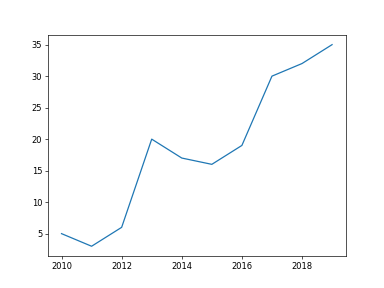</div>

- `seaborn`会自动标记x轴和y轴
- 踩坑备注
    - `lineplot`需要更新`seabron`至`0.9.0`
```Python
# 使用 Seaborn 画折线图
df = pd.DataFrame({'x': x, 'y': y})
sns.lineplot(x="x", y="y", data=df)
plt.show()
```
<div align="center">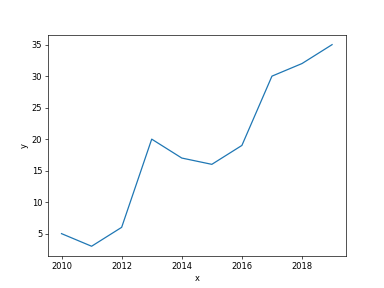</div>    

```Python
# 与lineplot类似，但是会着重数据点标注出来
sns.set_style("darkgrid")
df = pd.DataFrame({'x': x, 'y': y})
sns.pointplot(x="x", y="y", data=df)
plt.show()
```
<div align="center">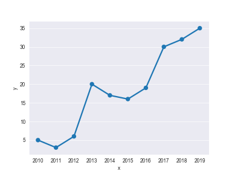</div>    

## 散点图
```Python
import numpy as np
import pandas as pd
import matplotlib.pyplot as plt
import seaborn as sns
# 数据准备
N = 1000
x = np.random.randn(N)
y = np.random.randn(N)
# 用 Matplotlib 画散点图
plt.scatter(x, y,marker='x')
plt.show()
```
<div align="center">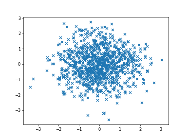</div>

- `seaborn`画出来的是正方形，而且还呈现两个变量的分布
```Python
# 用 Seaborn 画散点图
df = pd.DataFrame({'x': x, 'y': y})
sns.jointplot(x="x", y="y", data=df, kind='scatter');
plt.show()
```
<div align="center">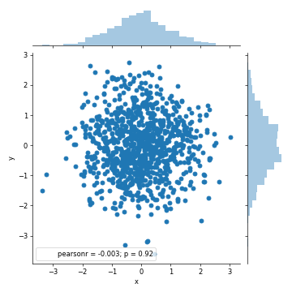</div>


## 直方图
- 参数有`bins`
- `kde`
    - 表示核密度估计

```Python
import numpy as np
import pandas as pd
import matplotlib.pyplot as plt
import seaborn as sns
# 数据准备
a = np.random.randn(100)
s = pd.Series(a) 
# 用 Matplotlib 画直方图
plt.hist(s)
plt.show()
```
<div align="center">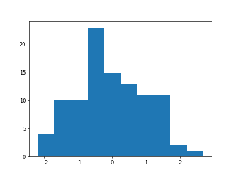</div>

```Python
# 用 Seaborn 画直方图
sns.distplot(s, kde=False)
plt.show()
```

<div align="center">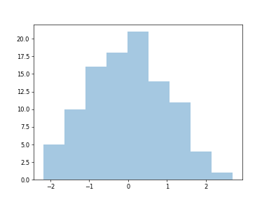</div>

```Python
sns.distplot(s, kde=True)
plt.show()
```

<div align="center">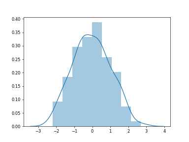</div>

## 条形图
- 查看特征分布

```Python
import matplotlib.pyplot as plt
import seaborn as sns
# 数据准备
x = ['Cat1', 'Cat2', 'Cat3', 'Cat4', 'Cat5']
y = [5, 4, 8, 12, 7]
# 用 Matplotlib 画条形图
plt.bar(x, y)
plt.show()
```
<div align="center">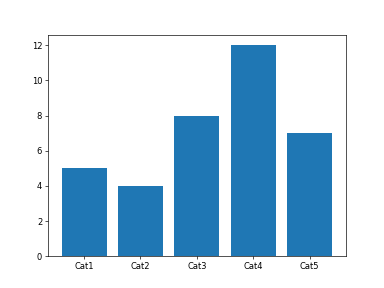</div>

- `sns.barplot(x=None, y=None, data=None)`,其中`data`为`dataFrame`的类型
```Python
# 用 Seaborn 画条形图
sns.barplot(x, y)
plt.show()
```
<div align="center">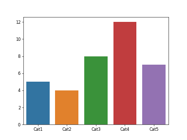</div>

## 箱线图
**定义**
```
- 箱线图，又称盒式图，它是在1977年提出的，由五个数值点组成：最大值(max)、最小值(min)、中位数（median）和上下四分位数(Q3, Q1)。它用来分析数据的差异性，离散程度和异常值等。
```

```Python
import numpy as np
import pandas as pd
import matplotlib.pyplot as plt
import seaborn as sns
# 数据准备
# 生成 0-1 之间的 10*4 维度数据
data=np.random.normal(size=(10,4)) 
lables = ['A','B','C','D']
# 用 Matplotlib 画箱线图
plt.boxplot(data,labels=lables)
plt.show()
```

<div align="center">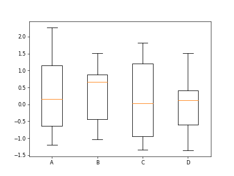</div>

```Python
# 用 Seaborn 画箱线图
df = pd.DataFrame(data, columns=lables)
sns.boxplot(data=df)
plt.show()
```
<div align="center">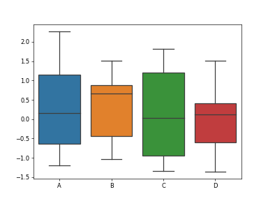</div>


## 饼图
```Python
import matplotlib.pyplot as plt
# 数据准备
nums = [25, 37, 33, 37, 6]
labels = ['High-school','Bachelor','Master','Ph.d', 'Others']
# 用 Matplotlib 画饼图
plt.pie(x = nums, labels=labels)
plt.show()
```

<div align="center">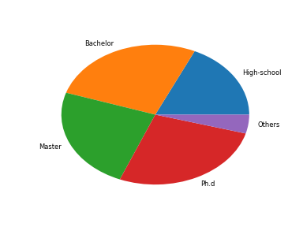</div>


## sns.countplot显示一个数据表中的某一列数据里的成分
```Python
import seaborn as sns
import matplotlib.pyplot as plt
sns.set_style("darkgrid")
sns.countplot(x="Survived", hue="Sex", data=train_data)
plt.show()
```
<div align="center">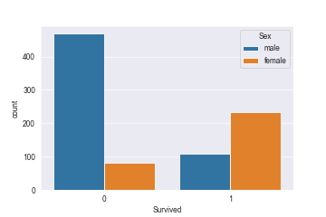</div>

## sns.kdeplot显示连续分布
```Python
facet = sns.FacetGrid(train, hue="Survived",aspect=2)
facet.map(sns.kdeplot,'Fare',shade= True)
facet.set(xlim=(0, 200))
facet.add_legend()
```
<div align="center">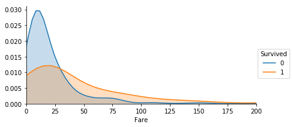</div>

## 高阶
### 热力图
- 一种多元变量分析方法
- 同时是一种矩阵表示方法，通过颜色直观地知道某个位置上数值的大小
```Python
import matplotlib.pyplot as plt
import seaborn as sns
# 数据准备
flights = sns.load_dataset("flights")
data=flights.pivot('year','month','passengers')
# 用 Seaborn 画热力图
sns.heatmap(data)
plt.show()
```

**实战Tip**
```Python
# 用热力图呈现 features_mean 字段之间的相关性
corr = data[features_mean].corr()
plt.figure(figsize=(14,14))
# annot=True 显示每个方格的数据
sns.heatmap(corr, annot=True)
plt.show()
```
<div align="center">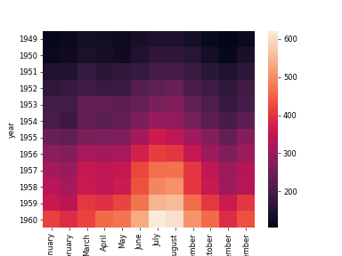</div>

### 蜘蛛图
- 这个图本质上是一种综合应用
- 注意`np.concatenate((stats,[stats[0]]))`，因为是环形的图，所以需要多增加一位
- 作者另外还引入了中文字体
```Python
import numpy as np
import matplotlib.pyplot as plt
import seaborn as sns
from matplotlib.font_manager import FontProperties  
# 数据准备
labels=np.array([u" 推进 ","KDA",u" 生存 ",u" 团战 ",u" 发育 ",u" 输出 "])
stats=[83, 61, 95, 67, 76, 88]
# 画图数据准备，角度、状态值
angles=np.linspace(0, 2*np.pi, len(labels), endpoint=False)
stats=np.concatenate((stats,[stats[0]]))
angles=np.concatenate((angles,[angles[0]]))
# 用 Matplotlib 画蜘蛛图
fig = plt.figure()
ax = fig.add_subplot(111, polar=True)   
ax.plot(angles, stats, 'o-', linewidth=2)
ax.fill(angles, stats, alpha=0.25)
# 设置中文字体
font = FontProperties(fname=r"C:\Windows\Fonts\simhei.ttf", size=14)  
ax.set_thetagrids(angles * 180/np.pi, labels, FontProperties=font)
plt.show()
```

<div align="center">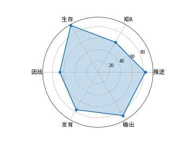</div>

### lmplot线性回归可视化
> 知乎/[seaborn入门（四）：回归模型lmplot](https://zhuanlan.zhihu.com/p/25909753)
```Python
import matplotlib.pyplot as plt
import seaborn as sns
# sns.set_style("whitegrid")
sns.set(context="notebook", style="whitegrid",palette="dark")
tips = sns.load_dataset("tips") 
# 研究小费tips与总消费金额total_bill在不同日子的关系
g = sns.lmplot(x="total_bill", y="tip", col="day", hue="day",data=tips, col_wrap=2, size=3)
```
<div align="center">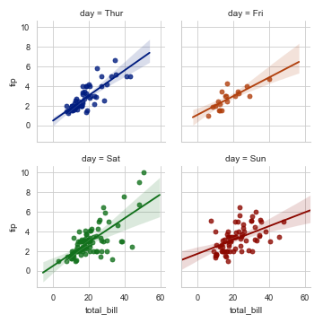</div>

### 二元变量关系
- 相当于`seaborn`的`scatter`的扩展
```Python
import matplotlib.pyplot as plt
import seaborn as sns
# 数据准备
tips = sns.load_dataset("tips")
print(tips.head(10))
# 用 Seaborn 画二元变量分布图（散点图，核密度图，Hexbin 图）
sns.jointplot(x="total_bill", y="tip", data=tips, kind='scatter')
sns.jointplot(x="total_bill", y="tip", data=tips, kind='kde')
sns.jointplot(x="total_bill", y="tip", data=tips, kind='hex')
plt.show()
```
<div align="center">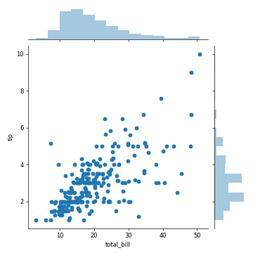</div>
<div align="center">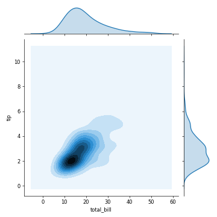</div>
<div align="center"></div>

### 成对关系
```Python
import matplotlib.pyplot as plt
import seaborn as sns
# 数据准备
iris = sns.load_dataset('iris')
# 用 Seaborn 画成对关系
sns.pairplot(iris)
plt.savefig(r"D:\学海无涯\笔记整理\2019-alogorithm-interview\_image\pairplot_fig1.png", format='png', dpi=60)

plt.show()
```
<div align="center">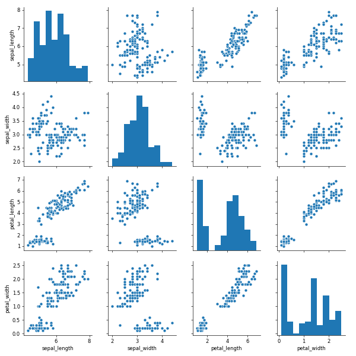</div>
