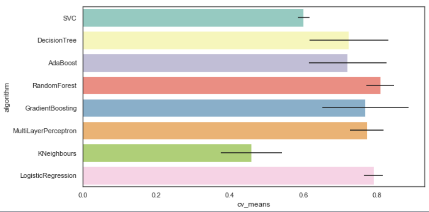

<!-- TOC -->

- [头文件](#%E5%A4%B4%E6%96%87%E4%BB%B6)
- [去除warning](#%E5%8E%BB%E9%99%A4warning)
- [array 转换成 dataframe](#array-%E8%BD%AC%E6%8D%A2%E6%88%90-dataframe)
- [载入图像，并对数据规范化](#%E8%BD%BD%E5%85%A5%E5%9B%BE%E5%83%8F%E5%B9%B6%E5%AF%B9%E6%95%B0%E6%8D%AE%E8%A7%84%E8%8C%83%E5%8C%96)
- [查找最优模型](#%E6%9F%A5%E6%89%BE%E6%9C%80%E4%BC%98%E6%A8%A1%E5%9E%8B)
- [定制转换器](#%E5%AE%9A%E5%88%B6%E8%BD%AC%E6%8D%A2%E5%99%A8)
- [Pipeline](#pipeline)
- [交叉验证](#%E4%BA%A4%E5%8F%89%E9%AA%8C%E8%AF%81)
- [Grid Search](#grid-search)
- [Randomized Search](#randomized-search)
- [机器学习八个步骤](#%E6%9C%BA%E5%99%A8%E5%AD%A6%E4%B9%A0%E5%85%AB%E4%B8%AA%E6%AD%A5%E9%AA%A4)

<!-- /TOC -->

## 头文件
```Python
import pandas as pd
import numpy as np
import matplotlib.pyplot as plt
import seaborn as sns
%matplotlib inline

from collections import Counter

from sklearn.ensemble import RandomForestClassifier, AdaBoostClassifier, GradientBoostingClassifier, ExtraTreesClassifier, VotingClassifier
from sklearn.discriminant_analysis import LinearDiscriminantAnalysis
from sklearn.linear_model import LogisticRegression
from sklearn.neighbors import KNeighborsClassifier
from sklearn.tree import DecisionTreeClassifier
from sklearn.neural_network import MLPClassifier
from sklearn.svm import SVC
from sklearn.model_selection import GridSearchCV, cross_val_score, StratifiedKFold, learning_curve

sns.set(style='white', context='notebook', palette='deep')
```

## 去除warning
```Python
import warnings
warnings.filterwarnings('ignore')
```

## array 转换成 dataframe
```Python   
housing_tr = pd.DataFrame(X, columns=housing_num.columns,
                          index = list(housing.index.values))
```

## 载入图像，并对数据规范化
```Python
import PIL.Image as image
def load_data(filePath):
    # 读文件
    f = open(filePath,'rb')
    data = []
    # 得到图像的像素值
    img = image.open(f)
    # 得到图像尺寸
    width, height = img.size
    for x in range(width):
        for y in range(height):
            # 得到点(x,y)的三个通道值
            c1, c2, c3 = img.getpixel((x, y))
            data.append([c1, c2, c3])
    f.close()
    # 采用Min-Max规范化
    mm = preprocessing.MinMaxScaler()
    data = mm.fit_transform(data)
    return np.mat(data), width, height
```

## 查找最优模型
当不知道该用什么模型时，用多个默认参数的模型开始尝试
```Python
random_state = 2
classifiers = []

classifiers.append(SVC(random_state=random_state))
classifiers.append(DecisionTreeClassifier(random_state=random_state))
classifiers.append(AdaBoostClassifier(DecisionTreeClassifier(random_state=random_state), random_state=random_state, learning_rate=0.1))
classifiers.append(RandomForestClassifier(random_state=random_state))
classifiers.append(GradientBoostingClassifier(random_state=random_state))
classifiers.append(MLPClassifier(random_state=random_state)) # 多层神经网络
classifiers.append(KNeighborsClassifier())
classifiers.append(LogisticRegression(random_state=random_state))

cv_results = []
for classifier in classifiers:
    cv_results.append(cross_val_score(classifier, X_train, Y_train, scoring='accuracy', cv = kfold))

cv_means = []
cv_stds = []
for result in cv_results:
    cv_means.append(result.mean())
    cv_stds.append(result.std())

cv_res_df = pd.DataFrame({"cv_means":cv_means, "cv_stds":cv_stds, \
                          "algorithm":["SVC", "DecisionTree", "AdaBoost", "RandomForest", "GradientBoosting", \
                                      "MultiLayerPerceptron", "KNeighbours", "LogisticRegression"]})

```
<div align="center"></div>

## 定制转换器
虽然Scikit-Learn提供了许多有用的transformers，但我们需要编写我们自己的transformer来执行诸如自定义清理操作或特定组合属性等任务。 我们希望自定义的transformers与Scikit-Learn的功能（例如管道）无缝协作，并且由于Scikit-Learn依赖于duck typing（不是继承），所以你需要的只是创建一个类并实现三个函数：
* fit（）返回self（）
* transform（）
* fit_transform（）

最后一个只需要添加**TransformerMixin**作为基类即可实现。 此外，如果将**BaseEstimator**添加为基类（并避免构造函数中的* args和** kargs），我们可以获得两个额外的方法（get_params（）和set_params（）），这些方法对自动调整超参数很有用。 例如，这是一个小型transformer类，它添加了我们前面讨论过的组合属性：

```Python
from sklearn.base import BaseEstimator, TransformerMixin

# column index-列索引
rooms_ix, bedrooms_ix, population_ix, household_ix = 3, 4, 5, 6

class CombinedAttributesAdder(BaseEstimator, TransformerMixin):
    def __init__(self, add_bedrooms_per_room = True): # no *args or **kargs
        self.add_bedrooms_per_room = add_bedrooms_per_room
    def fit(self, X, y=None):
        return self  # nothing else to do
    def transform(self, X, y=None):
        rooms_per_household = X[:, rooms_ix] / X[:, household_ix]
        population_per_household = X[:, population_ix] / X[:, household_ix]
        if self.add_bedrooms_per_room:
            bedrooms_per_room = X[:, bedrooms_ix] / X[:, rooms_ix]
            return np.c_[X, rooms_per_household, population_per_household,
                         bedrooms_per_room]
        else:
            return np.c_[X, rooms_per_household, population_per_household]

attr_adder = CombinedAttributesAdder(add_bedrooms_per_room=False)
housing_extra_attribs = attr_adder.transform(housing.values)
```

## Pipeline
```Python
from sklearn.pipeline import Pipeline
from sklearn.preprocessing import StandardScaler

num_pipeline = Pipeline([
        ('imputer', Imputer(strategy="median")),
        ('attribs_adder', CombinedAttributesAdder()),
        ('std_scaler', StandardScaler()),
    ])

housing_num_tr = num_pipeline.fit_transform(housing_num)
```

```Python
from sklearn.compose import ColumnTransformer
num_attribs = list(housing_num)
cat_attribs = ["ocean_proximity"]

full_pipeline = ColumnTransformer([
        ("num", num_pipeline, num_attribs),
        ("cat", OneHotEncoder(), cat_attribs),
    ])

housing_prepared = full_pipeline.fit_transform(housing)
```
## 交叉验证
一个很好的选择是使用Scikit-Learn的**交叉验证**功能。 以下代码执行**K-fold**交叉验证：它将训练集随机分成10个不同的子集称为**folds**，然后它训练和评估决策树模型10次，每次选择不同的**fold**进行评估，在另外9个**folds**上进行训练。结果是一个包含10个评估分数的数组
```Python
from sklearn.model_selection import cross_val_score

scores = cross_val_score(tree_reg, housing_prepared, housing_labels,
                         scoring="neg_mean_squared_error", cv=10)

tree_rmse_scores = np.sqrt(-scores)

```

## Grid Search
```Python
from sklearn.model_selection import GridSearchCV

param_grid = [
    # try 12 (3×4) combinations of hyperparameters
    {'n_estimators': [3, 10, 30], 'max_features': [2, 4, 6, 8]},
    # then try 6 (2×3) combinations with bootstrap set as False
    {'bootstrap': [False], 'n_estimators': [3, 10], 'max_features': [2, 3, 4]},
  ]

forest_reg = RandomForestRegressor(random_state=42)
# train across 5 folds, that's a total of (12+6)*5=90 rounds of training 
gsForest = GridSearchCV(forest_reg, 
                           param_grid, 
                           cv=5,
                           scoring='neg_mean_squared_error', 
                           return_train_score=True)

gsForest.fit(housing_prepared, housing_labels)

gsForest.best_params_
gSForest.best_estimator_

cvres = grid_search.cv_results_
for mean_score, params in zip(cvres["mean_test_score"], cvres["params"]):
    print(np.sqrt(-mean_score), params)

pd.DataFrame(grid_search.cv_results_)
```

## Randomized Search
```Python
from sklearn.model_selection import RandomizedSearchCV
from scipy.stats import randint

param_distribs = {
        'n_estimators': randint(low=1, high=200),
        'max_features': randint(low=1, high=8),
    }

forest_reg = RandomForestRegressor(random_state=42)
rnd_search = RandomizedSearchCV(forest_reg, param_distributions=param_distribs,
                                n_iter=10, cv=5, scoring='neg_mean_squared_error', random_state=42)
rnd_search.fit(housing_prepared, housing_labels)

cvres = rnd_search.cv_results_
for mean_score, params in zip(cvres["mean_test_score"], cvres["params"]):
    print(np.sqrt(-mean_score), params)
```

## 机器学习八个步骤
1. 问题框架化，视野宏观化
2. 获取数据
- pd.read_csv() 返回DataFrame
- @proerty
    - .head()
    - .info(), 看数据类型
    - .describe(), 看数字属性摘要
    - .hist() 画直方图，快速了解数据, 我们希望数据呈钟形分布，所以会resize，同时剔除掉一些极端值
        > housing.hist(bins=50, figsize=(20,15))
    - .value_counts() 看每一列里的分类数据
- 创建并修改训练、验证、测试集
    - from sklearn.model_selection import train_test_split
        > train_set, test_set = train_test_split(housing, test_size=0.2, random_state=42)
    - from sklearn.model_selection import StratifiedShuffleSplit
        ```Python
        # 分层随机拆分，相对就要复杂一些 
        split = StratifiedShuffleSplit(n_splits=1, test_size=0.2, random_state=42)  
        for train_index, test_index in split.split(housing, housing["income_cat"]):
            strat_train_set = housing.loc[train_index]
            strat_test_set = housing.loc[test_index] 
        ```
    - 删除某个属性
        > set_.drop("income_cat", axis=1, inplace=True)
3. 探索数据以获得 深层次见解
- @property
    - .corr(),计算每对属性之间的标准相关性系数（也称为Pearson’s），并且可以继续.sort_values(ascending=False)排列相关性大小
        - 或者pandas.plotting的 scatter_matrix函数
            ```Python
            attributes = ["median_house_value",
              "median_income", 
              "total_rooms",
              "housing_median_age"]
            scatter_matrix(housing[attributes], figsize=(12, 8))
             ```
- 组合特征    
4. 准备数据以更好地将基础数据模式提供给机器学习算法
- 注意编写函数以方便服用，同时数据集需要copy
    ```Python
    housing = strat_train_set.drop("median_house_value", axis=1)
    housing_labels = strat_train_set["median_house_value"].copy()
    ```
- 数据清洗
    - .dropna(subset=["..."]) 删除相应区域
    - .drop() 删除整个属性
    - .fillna(,inplace=True) 填补相应的值，需要计算一个值
        - 补缺失值方法(from sklearn.preprocessing import Imputer)
            -imputer 需要fit_transform
- 处理文本和分类属性
    - from sklearn.preprocessing import LabelEncoder
    - from sklearn.preprocessing import OneHotEncoder
    - from sklearn.preprocessing import LabelBinarizer
        - 同样需要fit_transform(), 注意，返回的是array
- 特征缩放
    - from sklearn.preprocessing import StandardScaler
5. 探索不同的模型并列出最优模型
6. 微调模型并将它们组合成一个很好的解决方案
7. 展示您的解决方案
8. 运行，监控和维护您的系统 