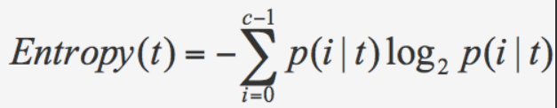

## 决策树
> 极客时间/数据分析实战45讲/[第17讲](https://time.geekbang.org/column/article/78273)

**原理** 
- 构造
    - 定义：构造的过程是选择什么属性作为节点的过程
        -  节点分为
            - 根节点
            - 内部节点
            - 叶节点
- 剪枝
    - 预剪枝(Pre-Pruning)
        - 在决策树构造时进行划分，如果对某个节点划分，在验证集中不能带来准确性的提升，那么对这个节点划分就没有意义。
    - 后剪枝(Post-Pruning)
        - 生成决策树后进行剪枝，如果剪掉这个节点，于保留该节点在分类准确性上差别不大，或者能带来准确性提升，那么久能剪枝。
        - 方法是将该节点子树的叶子节点来替代该节点，类标记为这个节点子树中最频繁的那个类

- 根节点的判定
    - 纯度
        - 可以把决策树的构造过程理解为寻找纯净划分的过程
        - 较高的纯度就是让目标变量的分歧最小
    - 信息熵
        - 表示了信息的不确定度

**结论**
- `信息熵`越大，`纯度`越低

**基于纯度的构造算法**
- 信息增益（ID3算法）
    - 将信息增益最大的节点作为父节点
    - 递归造树
    - 优点
        - 算法规则简单，可解释性强
    - 缺点
        - 对噪声敏感
        - 会选择取值比较多的属性
        - 有些属性可能对分类任务没有太大作用，但是仍然可能被选为最优属性
- 信息增益率（C4.5算法）
    - 用信息增益率对信息增益优化（对ID3的优化）
        - 信息增益率 = 信息增益/属性熵
    - 悲观剪枝提升泛化能力
        - 属于后剪枝算法
    - 能处理连续属性
        - C4.5选择具有最高信息增益的划分所对应的阈值
    - 能处理缺失值
    - 缺点是由于需要对数据集进行多次扫描，算法效率比较低
- 基尼指数（Cart算法）

