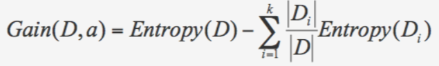
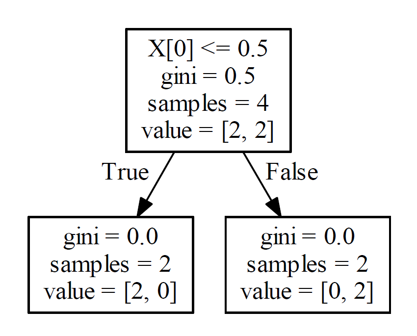

目录
---
<!-- TOC -->

- [决策树](#决策树)
    - [决策树的可视化](#决策树的可视化)
    - [使用sklearn运行决策树算法](#使用sklearn运行决策树算法)

<!-- /TOC -->
## 决策树
> 极客时间/数据分析实战45讲/[第20、21讲](https://time.geekbang.org/column/article/79294)

**原理** 
- 构造
    - 定义：构造的过程是选择什么属性作为节点的过程
        -  节点分为
            - 根节点
            - 内部节点
            - 叶节点
- 剪枝
    - 预剪枝(Pre-Pruning)
        - 在决策树构造时进行划分，如果对某个节点划分，在验证集中不能带来准确性的提升，那么对这个节点划分就没有意义。
    - 后剪枝(Post-Pruning)
        - 生成决策树后进行剪枝，如果剪掉这个节点，于保留该节点在分类准确性上差别不大，或者能带来准确性提升，那么久能剪枝。
        - 方法是将该节点子树的叶子节点来替代该节点，类标记为这个节点子树中最频繁的那个类

- 根节点的判定
    - 纯度
        - 可以把决策树的构造过程理解为寻找纯净划分的过程
        - 较高的纯度就是让目标变量的分歧最小
    - 信息熵
        - 表示了信息的不确定度
<div align="center"></div>

**结论**
- `信息熵`越大，`纯度`越低

**基于纯度的构造算法**
- 信息增益（ID3算法）
    - 将信息增益最大的节点作为父节点
    - 递归造树
    - 优点
        - 算法规则简单，可解释性强
    - 缺点
        - 对噪声敏感
        - 会选择取值比较多的属性
        - 有些属性可能对分类任务没有太大作用，但是仍然可能被选为最优属性
<div align="center"></div>

- 信息增益率（C4.5算法）
    - 用信息增益率对信息增益优化（对ID3的优化）
        - 信息增益率 = 信息增益/属性熵
    - 悲观剪枝提升泛化能力
        - 属于后剪枝算法
    - 能处理连续属性
        - C4.5选择具有最高信息增益的划分所对应的阈值
    - 能处理缺失值
    - 缺点是由于需要对数据集进行多次扫描，算法效率比较低
- 基尼指数（分类树Cart算法）
    - `ID3`和`C4.5`支持二叉树和多叉树，但是cart只支持二叉树。
    - 既可以作分类树，又可以作回归树
    - 基尼系数越小，说明样本之间差异性小
- "不纯度"(回归树cart算法)
    - 根据样本的离散程度来评价
        - 用差值的绝对值来评价，即为最小绝对偏差（LAD）
        - 用方差来评价，最小二乘偏差（LSD）
<div align="center"></div>


### 决策树的可视化
> CSDN/[决策树、随机森林结果可视化](https://blog.csdn.net/ydyang1126/article/details/78842952)
- `DecisionTreeClassifier`这个类默认使用`cart`算法(由`criterion=gini`确定)
- 踩坑备注
    - `Markdown`不支持`pdf`图片
```Python
from sklearn import tree
import sys
import os
import graphviz
import pydotplus
import numpy as np
from IPython.display import Image
os.environ["PATH"] += os.pathsep + r'D:\program\graphvis\bin'
data = np.array([[1,1],[1,0],[0,0],[0,0]])
target = np.array([1,1,0,0])

clf = tree.DecisionTreeClassifier()
clf = clf.fit(data, target)

dot_dta = tree.export_graphviz(clf, out_file=None)
graph = pydotplus.graph_from_dot_data(dot_dta)  
# jupyter notebook显示
Image(graph.create_png()) 
# 输出pdf
graph.write_pdf(r"D:\学海无涯\笔记整理\2019-alogorithm-interview\_image\decisiontree_fig2.pdf") 

```
<div align="center"></div>


### 使用sklearn运行决策树算法
**CART分类树**
```Python
# encoding=utf-8
from sklearn.model_selection import train_test_split
from sklearn.metrics import accuracy_score
from sklearn.tree import DecisionTreeClassifier
from sklearn.datasets import load_iris
# 准备数据集
iris=load_iris()
# 获取特征集和分类标识
features = iris.data
labels = iris.target
# 随机抽取 33% 的数据作为测试集，其余为训练集
train_features, test_features, train_labels, test_labels = train_test_split(features, labels, test_size=0.33, random_state=0)
# 创建 CART 分类树
clf = DecisionTreeClassifier(criterion='gini')
# 拟合构造 CART 分类树
clf = clf.fit(train_features, train_labels)
# 用 CART 分类树做预测
test_predict = clf.predict(test_features)
# 预测结果与测试集结果作比对
score = accuracy_score(test_labels, test_predict)
print("CART 分类树准确率 %.4lf" % score)
```

**CART回归树**
```Python
# encoding=utf-8
from sklearn.metrics import mean_squared_error
from sklearn.model_selection import train_test_split
from sklearn.datasets import load_boston
from sklearn.metrics import r2_score,mean_absolute_error,mean_squared_error
from sklearn.tree import DecisionTreeRegressor
# 准备数据集
boston=load_boston()
# 探索数据
print(boston.feature_names)
# 获取特征集和房价
features = boston.data
prices = boston.target
# 随机抽取 33% 的数据作为测试集，其余为训练集
train_features, test_features, train_price, test_price = train_test_split(features, prices, test_size=0.33)
# 创建 CART 回归树
dtr=DecisionTreeRegressor()
# 拟合构造 CART 回归树
dtr.fit(train_features, train_price)
# 预测测试集中的房价
predict_price = dtr.predict(test_features)
# 测试集的结果评价
print('回归树二乘偏差均值:', mean_squared_error(test_price, predict_price))
print('回归树绝对值偏差均值:', mean_absolute_error(test_price, predict_price)) 

```