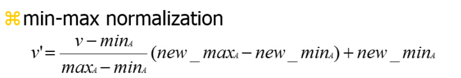

目录
---
<!-- TOC -->

- [目录](#%E7%9B%AE%E5%BD%95)
- [数据预处理——规范化](#%E6%95%B0%E6%8D%AE%E9%A2%84%E5%A4%84%E7%90%86%E8%A7%84%E8%8C%83%E5%8C%96)
- [异常点检测](#%E5%BC%82%E5%B8%B8%E7%82%B9%E6%A3%80%E6%B5%8B)
- [特征选择](#%E7%89%B9%E5%BE%81%E9%80%89%E6%8B%A9)
  - [Filter](#filter)
    - [单变量特征选择](#%E5%8D%95%E5%8F%98%E9%87%8F%E7%89%B9%E5%BE%81%E9%80%89%E6%8B%A9)
      - [卡方检验（分类问题）](#%E5%8D%A1%E6%96%B9%E6%A3%80%E9%AA%8C%E5%88%86%E7%B1%BB%E9%97%AE%E9%A2%98)
      - [Pearson相关系数 (Pearson Correlation)](#pearson%E7%9B%B8%E5%85%B3%E7%B3%BB%E6%95%B0-pearson-correlation)
      - [互信息和最大信息熵(Mutual information and maximal information coefficient (MIC)](#%E4%BA%92%E4%BF%A1%E6%81%AF%E5%92%8C%E6%9C%80%E5%A4%A7%E4%BF%A1%E6%81%AF%E7%86%B5mutual-information-and-maximal-information-coefficient-mic)
      - [基于模型的特征排序（Model based ranking）](#%E5%9F%BA%E4%BA%8E%E6%A8%A1%E5%9E%8B%E7%9A%84%E7%89%B9%E5%BE%81%E6%8E%92%E5%BA%8Fmodel-based-ranking)
  - [Wrapper(RFE)](#wrapperrfe)
    - [递归特征消除](#%E9%80%92%E5%BD%92%E7%89%B9%E5%BE%81%E6%B6%88%E9%99%A4)
  - [Embedded](#embedded)
    - [基于L1的特征选择（L1-based feature selection)](#%E5%9F%BA%E4%BA%8El1%E7%9A%84%E7%89%B9%E5%BE%81%E9%80%89%E6%8B%A9l1-based-feature-selection)
    - [基于树的特征选择 (Tree-based feature selection)](#%E5%9F%BA%E4%BA%8E%E6%A0%91%E7%9A%84%E7%89%B9%E5%BE%81%E9%80%89%E6%8B%A9-tree-based-feature-selection)
- [Pipeline](#pipeline)

<!-- /TOC -->

总结：standarization对树类算法基本没有影响，对svm的结果有影响，对回归算法基本没有影响（但能加速算法收敛），而feature_engineering常用的就RFE和random_forest。

## 数据预处理——规范化
- Z-Score规范化
    - 减去均值除以方差
    - 在分类、聚类算法中，需要使用距离来度量相似性的时候、或者使用PCA技术进行降维的时候需要使用
    - `StandardScaler()`
```Python
# 分割数据，将 25% 的数据作为测试集，其余作为训练集（你也可以指定其他比例的数据作为训练集）
train_x, test_x, train_y, test_y = train_test_split(data, digits.target, test_size=0.25, random_state=33)
# 采用 Z-Score 规范化
ss = preprocessing.StandardScaler()
train_ss_x = ss.fit_transform(train_x)
test_ss_x = ss.transform(test_x)
```

- MinMax规范化
<div align="center"></div>
    - 将属性缩放到一个指定的最小和最大值（通常是0-1）之间
    - 在不涉及距离度量、协方差计算、数据不符合正太分布的时候，可以使用。比如图像处理中，将RGB图像转换为灰度图像后将其值限定在[0 255]的范围。
    - `prepocessing.MinMaxScaler`
```Python
# 采用 Min-Max 规范化
mm = preprocessing.MinMaxScaler()
train_mm_x = mm.fit_transform(train_x)
test_mm_x = mm.transform(test_x)
```

## 异常点检测
- Tukey method (Tukey JW., 1977) to detect ouliers
```Python
def detect_outliers(df, n, features):
    """
    Takes a dataframe df of features and returns a list of the indices
    corresponding to the observations containing more than n outliers according
    to the Tukey method.
    """
    outlier_indices = []
    for column in features:
        Q1 = np.percentile(df[column], 25)
        Q3 = np.percentile(df[column], 75)
        # Interquartile Range(IQR)
        IQR = Q3 - Q1
        outlier_step= 1.5 * IQR
        
        outlier_list = df[(df[column] > Q3 + outlier_step) | (df[column] < Q1 - outlier_step)].index
        
        outlier_indices.extend(outlier_list)
    outlier_indices = Counter(outlier_indices)
    multiple_outliers = list(k for k,v in outlier_indices.items() if v > n)
    return multiple_outlierss
```

## 特征选择
> cn_blogs/[特征选择](http://www.cnblogs.com/stevenlk/p/6543628.html)  
> sklearn/[特征选择](http://sklearn.lzjqsdd.com/modules/feature_selection.html)
- 特征选择的形式根据特征选择方法可以分为三种:
  - `Filter`:过滤法，按照方差或者相关性对各个特征评分，选择特征
  - `Wrapper`:包装法，根据目标函数（通常是预测效果评分）
  - `Embedded`：嵌入法，先使用某些机器学习的算法和模型训练，得到各个特征的权值系数
  
### Filter
- 移除低方差的特征
  - `sklearn.feature_selection.VarianceThreshold`
```Python
#导入sklearn库中的VarianceThreshold
from sklearn.feature_selection import VarianceThreshold
#设置方差的阈值为0.8
sel = VarianceThreshold(threshold=.08)
#选择方差大于0.8的特征
X_sel=sel.fit_transform(X_scaler)
```


#### 单变量特征选择
##### 卡方检验（分类问题）
- 使用`SelectKBest`
```Python
 from sklearn.feature_selection import SelectKBest
 from sklearn.datasets import load_iris
 from sklearn.feature_selection import chi2
 iris = load_iris()
 X, y = iris.data, iris.target
 # X.shape (150, 4)
 X_new = SelectKBest(chi2, k=2).fit_transform(X, y)
 # X_new.shape (150, 2)
```

##### Pearson相关系数 (Pearson Correlation)
- 只对线性数据敏感(回归问题)
```Python
import numpy as np
from scipy.stats import pearsonr
np.random.seed(0)
size = 300
x = np.random.normal(0, 1, size)
# pearsonr(x, y)的输入为特征矩阵和目标向量
print("Lower noise", pearsonr(x, x + np.random.normal(0, 1, size)))
print("Higher noise", pearsonr(x, x + np.random.normal(0, 10, size)))
>>>
# 输出为二元组(sorce, p-value)的数组
Lower noise (0.71824836862138386, 7.3240173129992273e-49) # 相关性强，p-vale低
Higher noise (0.057964292079338148, 0.31700993885324746) # 相关性低
```

##### 互信息和最大信息熵(Mutual information and maximal information coefficient (MIC)
```Python
from minepy import MINE
m = MINE()
x = np.random.uniform(-1, 1, 10000)
m.compute_score(x, x**2)
print(m.mic())
>>>1.0
```

##### 基于模型的特征排序（Model based ranking）
直接使用要用的模型，针对每个单独的特征和响应变量建立预测模型。
```Python
from sklearn.cross_validation import cross_val_score, ShuffleSplit
from sklearn.datasets import load_boston
from sklearn.ensemble import RandomForestRegressor
import numpy as np

# Load boston housing dataset as an example
boston = load_boston()
X = boston["data"]
Y = boston["target"]
names = boston["feature_names"]

rf = RandomForestRegressor(n_estimators=20, max_depth=4)
scores = []
# 单独采用每个特征进行建模，并进行交叉验证
for i in range(X.shape[1]):
    score = cross_val_score(rf, X[:, i:i+1], Y, scoring="r2",  # 注意X[:, i]和X[:, i:i+1]的区别
                            cv=ShuffleSplit(len(X), 3, .3))
    scores.append((format(np.mean(score), '.3f'), names[i]))
print(sorted(scores, reverse=True))
```

### Wrapper(RFE)
#### 递归特征消除
- 使用一个基模型来进行多轮训练，每轮训练后，移除若干权值系数的特征，再基于新的特征集进行下一轮训练
```Python
from sklearn.feature_selection import RFE
from sklearn.linear_model import LogisticRegression

#递归特征消除法，返回特征选择后的数据
#参数estimator为基模型
#参数n_features_to_select为选择的特征个数
RFE(estimator=LogisticRegression(), n_features_to_select=2).fit_transform(iris.data, iris.target)
```

### Embedded
- 使用`SelectFromModel`选择特征 (Feature selection using SelectFromModel)
  - 有些机器学习方法本身就具有对特征进行打分的机制，或者很容易将其运用到特征选择上
    - 例如：svm，决策树，随机森林等等
  - 算法上讲`SelectFromModel`能够拟合任何拥有`coef_`或`feature_importances_`属性的预测模型

#### 基于L1的特征选择（L1-based feature selection)
- 常用于此目的的稀疏预测模型有：`linear_model.Lasso`，`linear_model.LogisticRegression`和`svm.LinearSVC`
```Python
 from sklearn.svm import LinearSVC
 from sklearn.datasets import load_iris
 from sklearn.feature_selection import SelectFromModel
 iris = load_iris()
 X, y = iris.data, iris.target
 # X.shape (150, 4)
 lsvc = LinearSVC(C=0.01, penalty="l1", dual=False).fit(X, y) # C控制稀疏性，C越小，泛化能力越好，被选中的特征越少
 # 分类器先前训练过,所以prefit=True
 model = SelectFromModel(lsvc, prefit=True)
 X_new = model.transform(X)
 # X_new.shape (150, 3)
```

- Note：随机稀疏模型：RandomizedLasso 实现了使用这项策略的Lasso，RandomizedLogisticRegression 使用逻辑回归

#### 基于树的特征选择 (Tree-based feature selection)
- `sklearn.tree`（树）
- `sklearn.ensemble`(森林)
```Python
 from sklearn.ensemble import ExtraTreesClassifier
 from sklearn.datasets import load_iris
 from sklearn.feature_selection import SelectFromModel
 iris = load_iris()
 X, y = iris.data, iris.target
 # X.shape (150, 4)
 clf = ExtraTreesClassifier()
 clf = clf.fit(X, y)
 clf.feature_importances_  
 # array([ 0.04...,  0.05...,  0.4...,  0.4...])

 # 选择重要性为1.25倍均值的特征
 # 分类器先前训练过,所以prefit=True
 model = SelectFromModel(clf, threshold='1.25*mean'，prefit=True)
 X_new = model.transform(X)
 # X_new.shape (150, 2)
```

## Pipeline
```Python
clf = Pipeline([
  ('feature_selection', SelectFromModel(LinearSVC(penalty="l1"))),
  ('classification', RandomForestClassifier())
])
clf.fit(X, y)
```