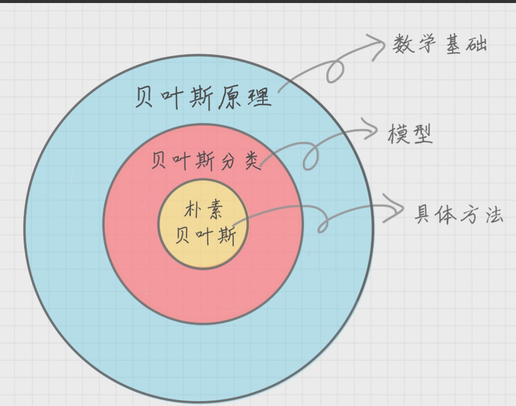

目录
---
<!-- TOC -->

- [朴素贝叶斯](#朴素贝叶斯)
    - [sklearn中的朴素贝叶斯](#sklearn中的朴素贝叶斯)
    - [TF-IDF](#tf-idf)
- [文档分类](#文档分类)
    - [模块1:分词](#模块1分词)
    - [模块2：加载停用词表](#模块2加载停用词表)
    - [模块3：计算单词的权重](#模块3计算单词的权重)
    - [模块4：生成朴素贝叶斯分类器](#模块4生成朴素贝叶斯分类器)
    - [模块5：使用生成的分类器做预测](#模块5使用生成的分类器做预测)
    - [模块6：计算准确率](#模块6计算准确率)

<!-- /TOC -->
## 朴素贝叶斯
> 极客时间/数据分析实战45讲/[第17、18讲](https://time.geekbang.org/column/article/78273)

**引入**
- 对于袋中摸球问题，如果我们不知道球袋内黑球和白球的比例，而通过我们摸出来的球的颜色，能判断出袋子内黑白球的数量吗？

**朴素贝叶斯模型的概率组成**
1. 每个`类别的概率`P(Cj)
    - c是目标函数的分类
2. 每个属性的`条件概率`P(Ai|cj)
    - 频率算法，某个类别的某特征呈现什么属性的概率
**朴素贝叶斯算法**
- 假设属性相互独立
- P(AiAjAk|cj)=P(Ai|cj)P(Aj|cj)P(Ak|cj)
<div align="center"></div>

### sklearn中的朴素贝叶斯
- 高斯朴素贝叶斯(GaussianNB)
    - 特征变量是连续变量，符合高斯分布，如：人的身高
- 多项式朴素贝叶斯(MultinomialNB)
    - 特征变量是离散变量，符合多项分布，如：文档分类中特征变量体现在一个单词出现的次数，或者是单词的TF-IDF值等
- 伯努利朴素贝叶斯(BernoulliNB)
    - 特征变量是布尔变量，符合0/1分布，如：在文档分类中单词是否出现

### TF-IDF
- 一种统计方法，用于评估某个词语对一个文件集或文档库中的其中一份文件的重要程度
- 词频 TF(Term Frequency)
    - 一个单词在文档中出现的次数
    - 公式：单词出现次数/该文档的总单词数
- 逆向文档频率 IDF(Inverse Document Frequency)
    - 一个单词在文档中的区分度 
    - 公式：log(文档总数 / (该单词出现的文档数 + 1))
- TF-IDF是TF与IDF的乘积
    - 乘积越大，越说明这个单词适合分类

```Python
from sklearn.feature_extraction.text import TfidfVectorizer
# 参数包括stop_words和token_patter，分别代表停用词和正则规则
tfidf_vec = TfidfVectorizer()

documents = [
    'this is the bayes document',
    'this is the second second document',
    'and the third one',
    'is this the document'
]
tfidf_matrix = tfidf_vec.fit_transform(documents)

print('不重复的词:', tfidf_vec.get_feature_names())
print('每个单词的 ID(字典型):', tfidf_vec.vocabulary_)
print('每个单词的idf值:', tfidf_vec.idf_)
print('停用词表:',tfidf_vec.stop_words_)
print('每个单词的 tfidf 值:', tfidf_matrix.toarray())
```

## 文档分类

**步骤**
1. 基于分词的数据准备, 包括分词、加载停用词、单词权重计算
2. 应用朴素贝叶斯算法进行分类

***六个模块***
### 模块1:分词
- 英文
    - 常用nltk包
```Python
import nltk
word_list = nltk.word_tokenize(text) # 分词
nltk.pos_tag(word_list) # 标注单词的词性
```
- 中文
    - 常用jieba
```Python
import jieba
word_list = jieba.cut (text) # 中文分词
```

### 模块2：加载停用词表
- 中文的停用词表需要自己下载读取
```Python
stop_words = [line.strip().decode('utf-8') for line in io.open('stop_words.txt').readlines()]
```

### 模块3：计算单词的权重
```Python
# max_df=0.5表示一个单词在50%的文档中都使用过就不再使用
tf = TfidfVectorizer(stop_words=stop_words, max_df=0.5)
features = tf.fit_transform(train_contents)
```
### 模块4：生成朴素贝叶斯分类器
- alpha=1 使用Laplace平滑，方法：加1
- alpha=0.001 使用Lidstone平滑，alpha越小，迭代次数越多 
```Python
# 多项式贝叶斯分类器
from sklearn.naive_bayes import MultinomialNB  
clf = MultinomialNB(alpha=0.001).fit(train_features, train_labels)
```

### 模块5：使用生成的分类器做预测
```Python
# 得到测试集的特征矩阵(模块3和4的重复)
test_tf = TfidfVectorizer(stop_words=stop_words, max_df=0.5, vocabulary=train_vocabulary)
test_features=test_tf.fit_transform(test_contents)
predicted_labels=clf.predict(test_features)
# 预测
predicted_labels=clf.predict(test_features)
```

### 模块6：计算准确率
```Python
from sklearn import metrics
print metrics.accuracy_score(test_labels, predicted_labels)
```

