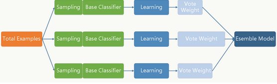
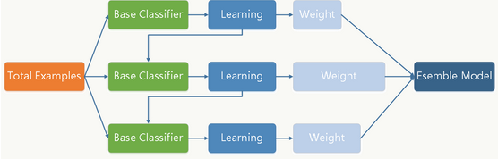

> csuldw/[组合算法总结](http://www.csuldw.com/2015/07/22/2015-07-22%20%20ensemble/)
## Boostraping
- 出自"pull up by your own bootstraps"
- 即自助法，是一种有放回的抽样方法

- `Bagging` 和 `Boosting` 都是通过某种策略把多个弱学习器组合起来
## bagging袋装
- 算法：
  - 每次通过有放回抽样（Boostraping）抽取n个训练样本，一共进行k轮，获得k个训练集
  - 训练得到三个model
  - 分类问题投票得到结果，回归问题计算均值得到结果
- 多专家投票表决
- 每个分类器都随机从原样本中做有放回的采样，然后分别在这些采样后的样本上训练分类器，然后再把这些分类器组合起来。简单的多数投票一般就可以。其代表算法是随机森林。
- 代表算法：`randomforest`
```Python
 from sklearn.ensemble import RandomForestClassifier
 X = [[0, 0], [1, 1]]
 Y = [0, 1]
 clf = RandomForestClassifier(n_estimators=10)
 clf = clf.fit(X, Y)
```
<div align="center"></div>


## 提升Boosting与AdaBoost
- 两个核心问题
  - （1）通过提高上一轮被弱分类器分错样例的权值，减小前一轮分对样例的取值（即根据错误率采样）
  - （2）用加法模型投票，增大错误率小的分类器的权值，同时减小错误率大的分类器的权值
- boosting中最主要的就是AdaBoost(Adaptive boosting), 即自适应boosting
- 代表算法：`AdaBoost`, `GBDT`
```Python
 from sklearn.cross_validation import cross_val_score
 from sklearn.datasets import load_iris
 from sklearn.ensemble import AdaBoostClassifier
 iris = load_iris()
 clf = AdaBoostClassifier(n_estimators=100)
 scores = cross_val_score(clf, iris.data, iris.target)
 scores.mean()                             
```
<div align="center"></div>

## bagging与boosting的区别
二者的主要区别是取样方式不同。bagging采用均匀取样，而Boosting根据错误率来取样，因此boosting的分类精度要优于Bagging。bagging的训练集的选择是随机的，各轮训练集之间相互独立，而boosting的各轮训练集的选择与前面各轮的学习结果有关；bagging的各个预测函数没有权重，而boosting是有权重的；bagging的各个预测函数可以并行生成，而boosting的各个预测函数只能顺序生成。对于象神经网络这样极为耗时的学习方法。bagging可通过并行训练节省大量时间开销。

## 提升树模型
提升方法实际采用加法模型（即基函数的线性组合）与前向分步算法、以决策树为基函数的提升方法称为提升树。

## 梯度提升树(Gradient boosting)
当损失函数是平方损失或者指数损失时，每一步优化是很简单，但对一般损失函数而言，往往每一步优化不是那么容易，所以才有了梯度提升算法。
- 用损失函数的负梯度来近似残差

## XGBoosst
在GBDT算法的基础上添加了正则项防止模型过度复杂

优点：
1. XGBoost 在代价函数里加入了正则项，用于控制模型的复杂度。正则项里包含了树的叶子节点个数、每个叶子节点上输出的 score 的 L2 模的平方和。从 Bias-variancetradeoff 角度来讲，正则项降低了模型的 variance，使学习出来的模型更加简单，防止过拟合，这也是 XGBoost 优于传统 GBDT 的一个特性。
2. 并行处理
XGBoost 工具支持并行。Boosting 不是一种串行的结构吗?怎么并行的？注意 XGBoost 的并行不是 tree 粒度的并行，XGBoost 也是一次迭代完才能进行下一次迭代的（第 t 次迭代的代价函数里包含了前面 t-1 次迭代的预测值）。XGBoost 的并行是在特征粒度上的, XGBoost 在训练之前，预先对数据进行了排序，然后保存为block结构，后面的迭代中重复地使用这个结构，大大减小计算量。这个 block 结构也使得并行成为了可能，在进行节点的分裂时，需要计算每个特征的增益，最终选增益最大的那个特征去做分裂，那么各个特征的增益计算就可以开多线程进行。
3. 灵活性
XGBoost 支持用户自定义目标函数和评估函数，只要目标函数二阶可导就行。
4. 缺失值的处理
对于特征的值有缺失的样本，XGBoost 可以自动学习出它的分裂方向。
5. 剪枝
XGBoost 先从顶到底建立所有可以建立的子树，再从底到顶反向进行剪枝。比起 GBM，这样不容易陷入局部最优解。
6. 内置交叉验证
XGBoost 允许在每一轮 Boosting 迭代中使用交叉验证。因此，可以方便地获得最优 Boosting 迭代次数。而 GBM 使用网格搜索，只能检测有限个值。

缺点：
1. 算法参数多
2. 知识和处理结构化数据
3. 不适合处理超高维数据

主要参数及其作用：
1. `objective`， 学习任务，如选择`multi:softmax`则为多分类
2. `gamama`，用于控制是否后剪枝的参数, 越大越保守，一般0.1、0.2
3. `max_depth`，构建树的深度，越大越容易过拟合
4. `lambda`, L2正则化系数, 参数越大，模型越不容易过拟合
5. `num_round`,  XGBoost中梯度提升树的个数，值越大，学习能力越强
6. `eta`单棵提升树的学习率，通过缩减特征的权重使提升计算过程更加保守
```Python
from sklearn.datasets import load_iris
import xgboost as xgb
from xgboost import plot_importance
from matplotlib import pyplot as plt
from sklearn.model_selection import train_test_split

# read in the iris data
iris = load_iris()

X = iris.data
y = iris.target

X_train, X_test, y_train, y_test = train_test_split(X, y, test_size=0.2, random_state=0)

# 训练模型
model = xgb.XGBClassifier(max_depth=5, learning_rate=0.1, n_estimators=160, silent=True, objective='multi:softmax')
model.fit(X_train, y_train)

# 对测试集进行预测
ans = model.predict(X_test)

# 计算准确率
cnt1 = 0
cnt2 = 0
for i in range(len(y_test)):
    if ans[i] == y_test[i]:
        cnt1 += 1
    else:
        cnt2 += 1

print("Accuracy: %.2f %% " % (100 * cnt1 / (cnt1 + cnt2)))

# 显示重要特征
plot_importance(model)
plt.show()
```
