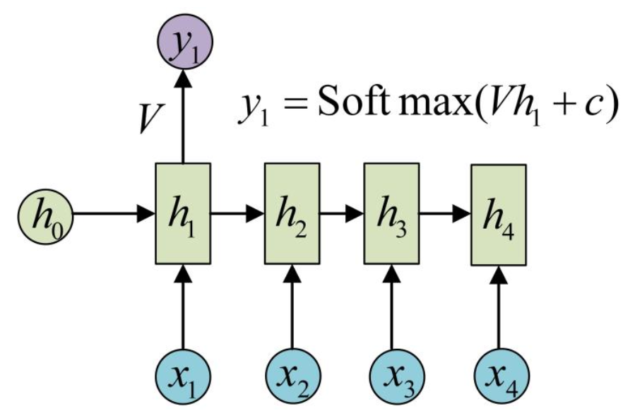

- CNN是前馈神经网络，RNN是反馈神经网络
- 什么叫反馈？
  - 将模型在当前位置的输出再反馈给模型，来帮助模型做下一位置的决策
  - 会引入w^t的输入，产生梯度消失和梯度爆炸问题(RNN中的记忆单元是短时的)
  - 因此会引入hidden，再加一个非线性映射

- LSTM
  - > [Step-by-step to LSTM: 解析LSTM神经网络设计原理](https://zhuanlan.zhihu.com/p/30465140)
  - 加法更适合做信息叠加，而乘法更适合做控制和scaling。

- RNN、LSTM、GRU的区别
  > [RNN、LSTM、GRU的区别]https://blog.csdn.net/qq_38210185/article/details/79376053