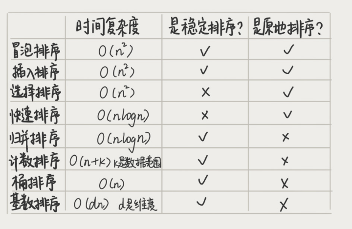

## 归并排序
- 递推公式
  - `merge(A, p, q) = merge(mergesort(A, p, r) + mergesort(A, r+1, q))`
  - 终止条件：`p >= q` 
- 归并排序是稳定的算法
- 最好、最坏、平均时间复杂度为O(nlogn)
- 空间复杂度为O(n)

## 快速排序
- 递推公式
  - `qsort(A, l, r) = qsort(A, l, p-1) + p + qsort(A, p+1, r) `
  - 终止条件：`l >= r`
- 快排是不稳定的算法
- 时间复杂度一般为O(nlogn)
- 快排是原地排序算法，空间复杂度为O(1)
> CSDN/[快速排序(三种算法实现和非递归实现)](https://blog.csdn.net/qq_36528114/article/details/78667034)

## 排序复杂度和稳定性分析

**典型算法题**
Q1： 如何用快排思想在O(n)内查找第K大元素？
Q2： 现在有10个接口访问日志文件，每个日志文件大小约300MB，每个文件里的日志都是按照时间戳从小到大排序的，你希望将这10个较小的日志文件，合并为1个日志文件，合并之后的日志仍然按照时间戳从小到大排列。内存只有1GB
A2： 桶排序
Q3: 对 D，a，F，B，c，A，z 这个字符串排序，小写要在大写前面，内部不要求排序顺序？
A3: 双指针

## 堆的应用
- 建堆时间复杂度O(N)
- 堆删除和插入的时间复杂度都是O(logN)
- 可以用来合并有序小文件
  - 每次从每个小文件中取出一个数据，比较出最小数据，再放入大文件中
- 高性能定时器
  - 不用每隔1s轮询任务列表
- Top K
- 求中位数